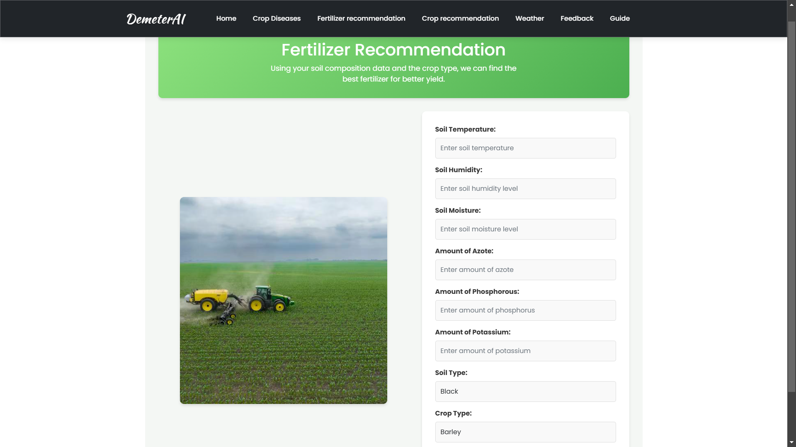
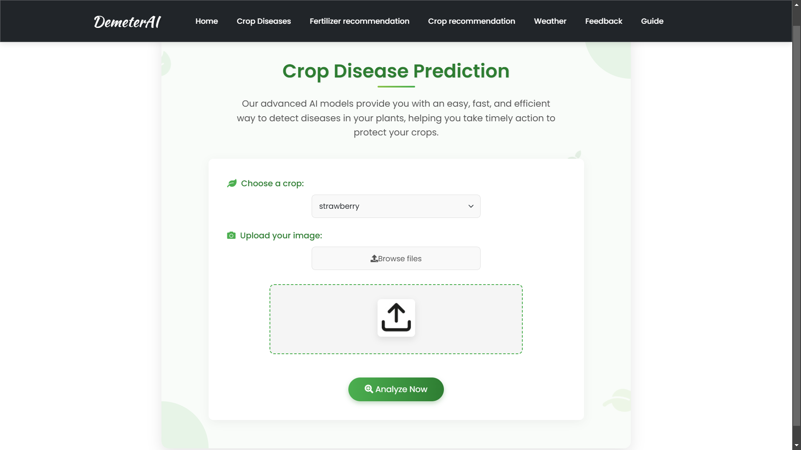
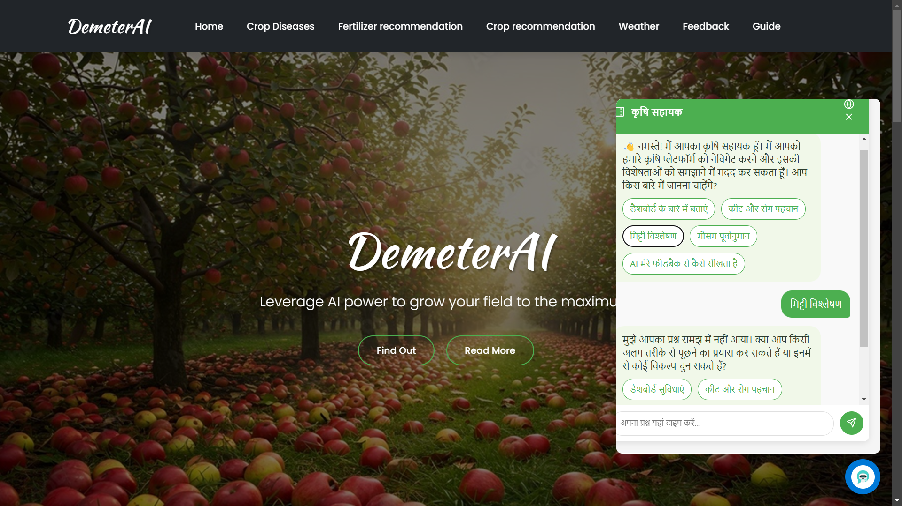

# 🌱 Demeter AI: Smart Farming Solutions 🚜

Agriculture faces numerous challenges including unpredictable weather, soil degradation, and plant diseases that reduce crop yields and impact food security. **Demeter AI** bridges the gap between traditional farming and advanced technologies by providing AI-powered tools for crop management.

## 🔍 The Problem

Farming is becoming increasingly complex due to:
* **Limited access to expert advice** for small-scale farmers
* **Inefficiency in crop selection** based on local conditions
* **Lack of knowledge about appropriate fertilizers** for specific soil and crops
* **Delayed disease detection** leading to reduced productivity

## ✨ Features

### 1. 🌾 Crop Recommendation


Demeter AI analyzes soil properties (NPK levels, moisture, temperature, rainfall) to suggest the most suitable crops for your specific farm conditions, ensuring optimized selection tailored to your environment.

### 2. 🧪 Fertilizer Suggestions


Using data on soil type, pH, temperature, and crop selection, Demeter AI provides precise fertilizer recommendations to maintain soil health, improve crop growth, and maximize yields.

### 3. 🔬 Crop Disease Detection


With our AI-powered image recognition system, simply upload a photo of your crop to identify diseases and evaluate plant health, allowing for quick interventions to prevent widespread damage.

### 4. ☁️ Weather Integration
![Weather Forecast]

Access real-time weather data for your farm location to help plan planting, irrigation, and harvesting activities with greater precision.

### 5. 🗣️ Multilingual Chatbot Assistant


Our integrated AI-powered chatbot provides farming advice and answers questions in multiple languages, making agricultural expertise accessible to farmers regardless of their native language.

## 🚀 Getting Started

### Clone the Repository

```
git clone https://github.com/vyomnikhra/DemeterAI.git
cd DemeterAI
```

### Run Locally with Python (v3.8)

1. **Create and activate a virtual environment**:
```
python -m venv venv
source venv/bin/activate  # On Windows: venv\Scripts\activate
```

2. **Install dependencies**:
```
pip install -r requirements.txt
```

3. **Start the server**:
```
python app.py
```

Visit the app at http://localhost:5000

## 📊 Dataset

The datasets used for this project are sourced from Kaggle:
* Crop Recommendation Dataset
* Fertilizer Recommendation Dataset
* Crop Disease Image Dataset

## 🛠️ Built With
* Flask
* TensorFlow
* scikit-learn
* Bootstrap

## 📬 Contact

For questions or support, please contact:
- Vyom Nikhra: vyomnikhra@gmail.com
- Dhruv Patel: dhruvsp2705@gmail.com
- Aadi Patel: aadipatel1911@gmail.com
- Vineet Tiwari: vinnet.tiwari2505@gmail.com
